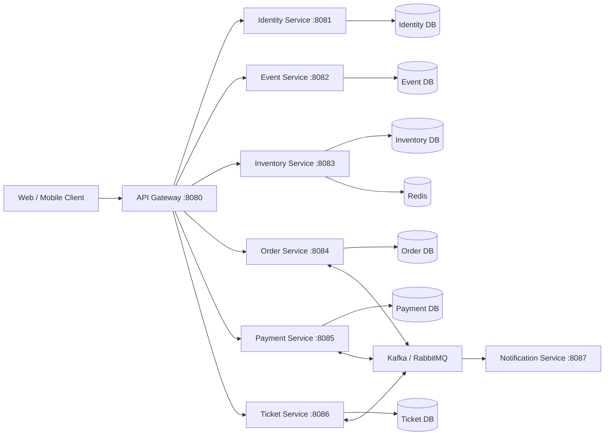

# FlashTicket 开发文档

## 1. 项目目标

FlashTicket 是一个面向演唱会、活动和其他现场演出的在线票务系统。系统计划支持活动浏览、场次与座位管理、限时锁座、订单创建、在线支付、电子票生成及消息通知。

抢票场景会在短时间内产生大量并发请求，因此系统设计的重点包括：

- 防止同一个座位被重复出售
- 控制高峰流量，避免服务被瞬间压垮
- 保证订单、支付和出票状态最终一致
- 支持失败重试、超时取消和问题追踪
- 保持各个业务服务能够独立开发和部署

> 当前状态：仓库目前只有 `api-gateway` 的基础 Spring Boot 项目。本文其余服务属于建议架构和后续开发计划，不代表已经实现。

## 2. 当前技术基础

根据现有 `api-gateway/pom.xml`，项目当前使用：

| 项目 | 当前配置 |
| --- | --- |
| Java | 21 |
| Spring Boot | 4.1.1 |
| Spring Cloud | 2025.1.3 |
| API Gateway | Spring Cloud Gateway Server Web MVC |
| Security | Spring Security、OAuth2 Resource Server |
| Cache / Rate Limit | Redis（依赖已加入，尚未配置） |
| Monitoring | Spring Boot Actuator |
| Build Tool | Maven Wrapper |

当前 Gateway 还没有路由、安全规则、Redis 连接或限流配置，默认端口为 `8080`。

## 3. 建议的系统架构



开发初期不需要一次完成所有服务。建议先完成一个可以端到端运行的 MVP，再逐步加入高并发和消息队列能力。

## 4. 需要开发的 Service

### 4.1 API Gateway（现有）

目录：`api-gateway/`

建议端口：`8080`

职责：

- 作为前端访问后端服务的统一入口
- 根据路径把请求转发到对应的业务服务
- 验证 JWT Access Token
- 实现 CORS、安全响应头和统一错误格式
- 使用 Redis 对登录、查询和抢票接口进行限流
- 生成或转发 `X-Request-Id`，方便跨服务追踪请求
- 暴露健康检查，但不向公网泄露敏感 Actuator 信息

建议路由：

| 请求路径 | 目标服务 |
| --- | --- |
| `/api/auth/**`、`/api/users/**` | Identity Service |
| `/api/events/**`、`/api/venues/**` | Event Service |
| `/api/inventory/**`、`/api/seats/**` | Inventory Service |
| `/api/orders/**` | Order Service |
| `/api/payments/**` | Payment Service |
| `/api/tickets/**` | Ticket Service |

Gateway 只负责入口层能力，不应该存放订单、支付或座位等业务逻辑。

### 4.2 Identity Service

建议目录：`identity-service/`

建议端口：`8081`

职责：

- 用户注册、登录和登出
- 密码加密与账户状态管理
- 签发和刷新 JWT
- 管理 `CUSTOMER`、`ORGANIZER`、`ADMIN` 等角色
- 保存用户资料和必要的登录审计信息

主要数据：`users`、`roles`、`refresh_tokens`。

### 4.3 Event Service

建议目录：`event-service/`

建议端口：`8082`

职责：

- 创建和管理活动、演出场次及销售时间
- 管理场馆、区域、排位和票价等级
- 提供活动列表、搜索和详情查询
- 管理活动状态，例如 `DRAFT`、`PUBLISHED`、`ON_SALE`、`ENDED`
- 提供主办方后台所需的活动管理 API

主要数据：`events`、`sessions`、`venues`、`seat_maps`、`price_tiers`。

图片本身建议保存到对象存储，数据库只保存 URL 和相关元数据。

### 4.4 Inventory Service

建议目录：`inventory-service/`

建议端口：`8083`

职责：

- 管理每个场次的可售座位或可售票数量
- 查询座位实时状态
- 在用户下单时临时锁定座位
- 锁定时间结束后自动释放座位
- 支付成功后把座位确认为已售出
- 使用原子操作防止同一个座位被两个订单同时占用

建议座位状态：

```text
AVAILABLE -> HELD -> SOLD
                \-> AVAILABLE（超时或订单取消）
```

Redis 可以用于短时间锁座和 TTL，但数据库仍然是最终库存记录。确认售出时应使用唯一约束、版本号或条件更新再次检查，不能只依靠前端显示的座位状态。

### 4.5 Order Service

建议目录：`order-service/`

建议端口：`8084`

职责：

- 根据已锁定的座位创建订单
- 保存订单项目、金额快照和订单状态
- 生成支付请求所需的业务单号
- 处理订单超时、用户取消和退款状态
- 编排库存、支付和出票流程
- 通过幂等键避免用户重复点击产生多张订单

建议订单状态：

```text
PENDING_PAYMENT -> PAID -> TICKET_ISSUED -> COMPLETED
       |             |
       v             v
   CANCELLED      REFUNDING -> REFUNDED
```

订单中应保存购买时的活动名称、场次、座位和价格快照，避免活动资料后续修改影响历史订单。

### 4.6 Payment Service

建议目录：`payment-service/`

建议端口：`8085`

职责：

- 对接第三方支付平台
- 创建支付交易并保存支付状态
- 验证支付回调或 Webhook 签名
- 处理重复回调，确保支付操作幂等
- 发起退款并记录第三方交易编号
- 发布支付成功或支付失败事件

安全要求：

- 不能信任前端传来的“支付成功”结果
- 必须以服务端验证过的支付平台回调为准
- API Key、Webhook Secret 等机密信息只能通过环境变量或 Secret Manager 提供
- 日志中不能输出银行卡信息、Token 或完整的敏感请求内容

### 4.7 Ticket Service

建议目录：`ticket-service/`

建议端口：`8086`

职责：

- 在确认付款后生成电子票
- 为每张票生成不可预测的唯一票号
- 生成带签名的 QR Code 内容
- 提供用户票夹和票券详情
- 支持入场验票，并原子地把票券标记为已使用
- 防止同一张电子票被重复核销

建议票券状态：`ACTIVE`、`USED`、`CANCELLED`、`REFUNDED`。

QR Code 不应只包含可以随意修改的普通票号。可以使用服务端签名的短期或受控 Token，验票时仍需向 Ticket Service 确认最终状态。

### 4.8 Notification Service

建议目录：`notification-service/`

建议端口：`8087`

职责：

- 监听订单、支付、出票和退款事件
- 发送 Email、SMS 或应用内通知
- 保存发送结果和失败原因
- 对临时失败进行有限次数的重试
- 确保重复消费同一个消息时不会重复发送

通知不应该阻塞支付或出票主流程。即使邮件暂时发送失败，已经成功的订单和电子票也不应回滚。

## 5. 基础设施依赖

| 组件 | 用途 | MVP 是否必需 |
| --- | --- | --- |
| PostgreSQL 或 MySQL | 保存用户、活动、库存、订单、支付和票券数据 | 是 |
| Redis | 限流、临时锁座、缓存和短期 Token | 是 |
| Kafka 或 RabbitMQ | 服务间事件、异步出票与通知 | 第二阶段加入 |
| Email Provider | 发送订单和电子票通知 | 第二阶段加入 |
| Object Storage | 保存活动海报等文件 | 可先使用本地文件代替 |
| Docker Compose | 统一启动本地依赖和服务 | 建议使用 |
| OpenTelemetry | 分布式追踪 | 稳定后加入 |
| Prometheus + Grafana | 指标收集和监控 | 稳定后加入 |

每个服务应拥有自己的数据库或独立 schema，并通过 API 或事件交换数据。不要让多个服务直接读写同一组业务表。

## 6. 核心业务流程

### 6.1 下单和支付

1. 用户通过 Event Service 查看活动和场次。
2. 用户通过 Inventory Service 查询可售座位。
3. Inventory Service 原子地锁定所选座位，并返回 `holdId` 和过期时间。
4. Order Service 验证 `holdId`，保存价格快照并创建待支付订单。
5. Payment Service 创建第三方支付交易。
6. 第三方支付平台调用后端 Webhook。
7. Payment Service 验证签名并发布 `PaymentSucceeded` 事件。
8. Order Service 把订单更新为 `PAID`。
9. Inventory Service 把座位从 `HELD` 更新为 `SOLD`。
10. Ticket Service 生成电子票。
11. Notification Service 向用户发送订单成功和电子票通知。

### 6.2 支付超时

1. Order Service 将超过支付期限的订单更新为 `CANCELLED`。
2. Inventory Service 释放对应座位。
3. 如果迟到的支付回调在取消后到达，应进入退款或人工复核流程，不能直接忽略。

## 7. 服务间通信原则

- 用户立即需要结果的查询使用 REST API。
- 支付成功、订单取消、出票和通知等后续动作使用消息事件。
- 所有写入接口都应考虑幂等性，尤其是下单、支付回调、退款和验票接口。
- 消费者处理消息后应记录事件 ID，避免重复消费产生副作用。
- 数据库更新和事件发布建议使用 Transactional Outbox，避免“数据库成功但消息发送失败”。
- 跨服务流程不使用分布式数据库事务，使用 Saga 和补偿操作保证最终一致性。

建议的事件名称：

```text
OrderCreated
OrderCancelled
PaymentSucceeded
PaymentFailed
InventoryConfirmed
InventoryReleased
TicketIssued
RefundCompleted
```

事件至少包含：`eventId`、`eventType`、`occurredAt`、`aggregateId`、`version` 和业务数据。

## 8. 安全要求

- 密码使用 BCrypt 或 Argon2 哈希，绝不保存明文密码。
- Gateway 验证 Token 后，下游服务仍需执行角色和资源归属检查。
- 抢票、登录、发送验证码和验票接口必须限流。
- 管理员与主办方接口使用明确的角色授权。
- 所有输入都需要服务端验证，不能只依靠前端校验。
- 支付 Webhook 必须验证签名、时间戳和重复事件。
- 日志应隐藏密码、JWT、支付密钥和个人敏感信息。
- 生产环境只通过 HTTPS 提供服务。

## 9. 建议的仓库结构

```text
FlashTicket/
├── api-gateway/
├── identity-service/
├── event-service/
├── inventory-service/
├── order-service/
├── payment-service/
├── ticket-service/
├── notification-service/
├── docker-compose.yml
├── .env.example
├── README.md
└── DEVELOPMENT.md
```

建议各个 Spring Boot 服务内部保持一致结构：

```text
src/main/java/com/flashticket/<service>/
├── config/
├── controller/
├── dto/
├── domain/
├── repository/
├── service/
├── event/
└── exception/
```

## 10. 环境变量建议

仓库应提供不含真实密码的 `.env.example`，例如：

```dotenv
JWT_ISSUER=http://localhost:8081
JWT_PUBLIC_KEY_LOCATION=

REDIS_HOST=localhost
REDIS_PORT=6379

DB_HOST=localhost
DB_PORT=5432
DB_USERNAME=flashticket
DB_PASSWORD=change-me

KAFKA_BOOTSTRAP_SERVERS=localhost:9092

PAYMENT_API_KEY=
PAYMENT_WEBHOOK_SECRET=
MAIL_API_KEY=
```

真实 `.env` 和任何密钥文件必须加入 `.gitignore`，不能上传到 GitHub。

## 11. API 设计约定

- API 统一使用 `/api/...` 前缀。
- 请求和响应使用 JSON。
- 时间使用 ISO 8601 UTC 格式，例如 `2026-09-16T10:30:00Z`。
- 金额使用 `BigDecimal` 和明确的币种字段，不能使用 `float` 或 `double`。
- 分页接口统一使用 `page`、`size` 和 `sort`。
- 错误响应应包含稳定的错误码，不要让前端依赖异常文字判断。

建议错误格式：

```json
{
  "timestamp": "2026-09-16T10:30:00Z",
  "status": 409,
  "code": "SEAT_ALREADY_HELD",
  "message": "The selected seat is no longer available.",
  "path": "/api/inventory/holds",
  "requestId": "9a61f5d8-4f7a-4cc5-84f4-1cfb16c927a8"
}
```

## 12. 测试策略

每个服务至少需要：

- 单元测试：业务状态转换、金额计算和验证规则
- Repository 测试：唯一约束、并发更新和数据库查询
- API 集成测试：认证、参数校验和错误响应
- Contract 测试：保证 Gateway、服务和事件格式兼容
- 并发测试：多个请求同时购买同一座位时只能有一个成功
- 端到端测试：浏览活动、锁座、下单、支付回调、出票和验票

推荐使用 Testcontainers 启动真实的 PostgreSQL/MySQL、Redis 和消息队列测试环境，避免只使用与生产行为不同的内存数据库。

## 13. 推荐开发顺序

### Phase 1：可运行的基础项目

- 配置 API Gateway 基础路由和 CORS
- 创建 Identity、Event、Inventory 和 Order Service
- 添加数据库、Redis 和 Docker Compose
- 完成登录、活动查询、锁座及创建订单

### Phase 2：完成交易闭环

- 创建 Payment 和 Ticket Service
- 接入支付 Sandbox
- 实现支付 Webhook、确认库存和电子票生成
- 创建 Notification Service

### Phase 3：可靠性与高并发

- 加入 Kafka 或 RabbitMQ
- 实现 Outbox、Saga、失败重试和死信队列
- 加入 Redis 限流、排队机制和热点活动缓存
- 执行并发测试、负载测试和故障测试

### Phase 4：部署与监控

- 为每个服务创建 Dockerfile
- 配置 CI 测试和构建流程
- 加入集中日志、指标、告警和分布式追踪
- 配置 Secret 管理、HTTPS、数据库备份和恢复方案

## 14. 当前下一步

建议先完成以下最小任务，不要立即创建所有服务的空项目：

1. 为 Gateway 添加端口、路由、CORS 和统一安全配置。
2. 创建 `identity-service`，完成注册、登录和 JWT。
3. 创建 `event-service`，完成活动、场次和座位图查询。
4. 创建 `inventory-service`，重点验证并发锁座不会重复售票。
5. 创建 `order-service`，跑通“锁座 → 创建订单 → 超时释放”的 MVP 流程。

完成以上流程后，再接入真实支付、消息队列、电子票和通知，可以减少早期服务过多但没有完整业务流程的问题。
