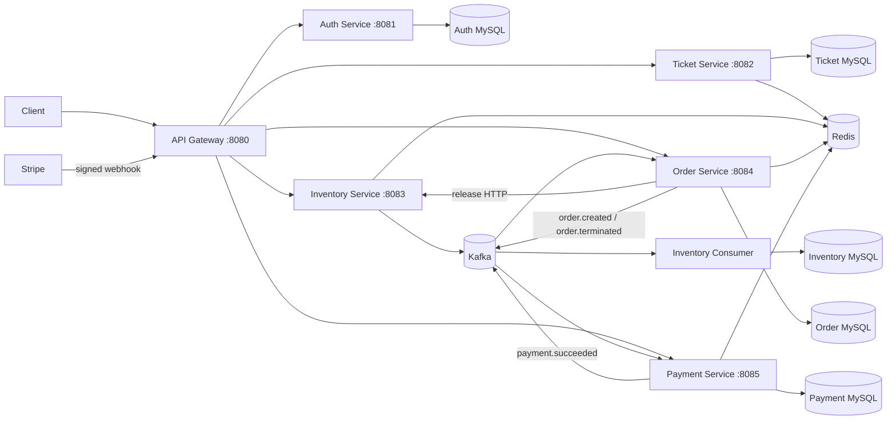

# FlashTicket 开发文档

> 本地部署、IntelliJ IDEA Run Configuration、Stripe CLI 和环境变量说明见 [DEPLOYMENT.md](./DEPLOYMENT.md)。最新实机验收结果见 [FINAL_RUNTIME_TEST.md](./FINAL_RUNTIME_TEST.md)。

## 1. 文档范围

本文记录当前仓库已经存在的服务、真实调用链、数据一致性边界、已验证结果和下一阶段工作。它不是一份脱离代码的理想架构草案。

当前已经跑通的最小业务闭环是：

```text
库存预留
  -> Kafka inventory.reserved
  -> 创建 PENDING_PAYMENT 订单
  -> Order Outbox -> Kafka order.created
  -> 创建 PENDING Payment
  -> 用户取消或五分钟未付款
  -> Order Outbox -> Kafka order.terminated
  -> Payment 同步为 CANCELLED 或 EXPIRED
  -> 持久化 inventory_release_tasks
  -> Worker 调用 Inventory Service
  -> Redis 与 MySQL 库存恢复
```

Stripe Checkout Session 创建已经实机验证；托管 Checkout 页面付款、签名 Webhook、Payment `SUCCEEDED` 和 Order `PAID` 仍需完成最后一笔 Test Mode 付款。电子票和通知尚未形成端到端闭环。

## 2. 当前服务状态

| 服务 | 端口 | 当前状态 | 主要存储 |
| --- | ---: | --- | --- |
| API Gateway | `8080` | 已实现 Auth、Ticket、Inventory、Order、Payment 路由、JWT 校验和部分限流 | Redis |
| Auth Service | `8081` | 已实现注册、登录、BCrypt 和 RSA JWT | `flashticket_auths` |
| Ticket Service | `8082` | 已实现票种 CRUD、状态更新和 Redis 缓存 | `flashticket_ticket`、Redis |
| Inventory Service | `8083` | 已实现库存 CRUD、Redis Lua 原子预留/释放、Kafka 同步和幂等消费 | `flashticket_inventory`、Redis |
| Order Service | `8084` | 已实现 Kafka 创建订单、查询、取消、支付标记、五分钟过期和释放任务重试 | `flashticket_order`、Redis |
| Payment Service | `8085` | 已实现 Kafka 幂等创建、查询、Stripe Checkout、签名 Webhook 和 Order 终态同步 | `flashticket_payment`、Redis |

Order 和 Payment 已接入 Gateway。Payment Service 已通过 Checkout Session、取消同步和过期同步的运行验证，但尚未完成 Stripe 付款成功全链路验收。

## 3. 当前架构


```mermaid
flowchart LR
    Client[Client] --> Gateway[API Gateway :8080]
    Gateway --> Auth[Auth Service :8081]
    Gateway --> Ticket[Ticket Service :8082]
    Gateway --> Inventory[Inventory Service :8083]
    Gateway --> Order[Order Service :8084]
    Gateway --> Payment[Payment Service :8085]
    Stripe[Stripe] -->|signed webhook| Gateway

    Auth --> AuthDB[(Auth MySQL)]
    Ticket --> TicketDB[(Ticket MySQL)]
    Ticket --> Redis[(Redis)]

    Inventory --> Redis
    Inventory --> Kafka[(Kafka)]
    Kafka --> InventoryConsumer[Inventory Consumer]
    Kafka --> Order
    InventoryConsumer --> InventoryDB[(Inventory MySQL)]

    Order --> OrderDB[(Order MySQL)]
    Order --> Redis
    Order -->|release HTTP| Inventory
    Order -->|order.created / order.terminated| Kafka

    Kafka --> Payment
    Payment --> PaymentDB[(Payment MySQL)]
    Payment --> Redis
    Payment -->|payment.succeeded| Kafka
```

Kafka 的多个消费者按服务使用独立 consumer group：

- `inventory-service` 消费 `inventory.reserved` 和 `inventory.release`，幂等更新 Inventory MySQL。
- `order-service` 消费 `inventory.reserved`，幂等创建待支付订单。
- `payment-service` 消费 `order.created` 和 `order.terminated`，创建 Payment 并同步取消/过期终态。
- `order-service` 消费 `payment.succeeded`，仅在订单未过期且仍为 `PENDING_PAYMENT` 时更新为 `PAID`。

因此同一条预留事件会分别到达两个服务，而不是在它们之间竞争消费。

## 4. 核心业务流程

### 4.1 正常预留与订单创建

1. 客户端调用 `POST /api/v1/inventory/{ticketId}/reserve`。
2. Inventory Service 通过 Ticket Service 检查销售时间与状态。
3. `reserve_stock.lua` 原子检查库存和用户预留 Key，并扣减 `inventory:stock:{ticketId}`。
4. Redis 写入 `inventory:reserved:{ticketId}:{userId}`，技术 TTL 为 900 秒。
5. Inventory Service 发布 `inventory.reserved`。
6. Inventory Consumer 在同一数据库事务内写入 `processed_events` 并把 MySQL 库存从 available 移到 reserved。
7. Order Consumer 在同一数据库事务内记录事件并创建 `PENDING_PAYMENT` 订单。
8. Order Service 从 Ticket Service 获取权威单价，保存数量、单价、总额和 `expires_at=now+5 minutes`。
9. Order Outbox 发布 `order.created`，Payment Service 幂等创建一条 `PENDING` Payment。

900 秒 Redis TTL 是故障安全缓冲，不是业务付款期限。业务过期时间的唯一依据是 `orders.expires_at`。

### 4.2 用户取消

1. 客户端调用 `POST /api/v1/orders/{orderId}/cancel`。
2. Order Service 使用条件 SQL，只允许 `PENDING_PAYMENT -> CANCELLED`。
3. 状态更新成功后，在同一事务中插入一条 `inventory_release_tasks`。
4. Worker 将任务从 `PENDING` 原子 claim 为 `PROCESSING`。
5. Worker 使用任务中持久化的 `releaseId` 调用 Inventory Service。
6. Inventory Service 使用 Lua 恢复 Redis，并发布 `inventory.release`。
7. Inventory Consumer 通过 `processed_events.event_id` 保证 MySQL 只释放一次。
8. Worker 将任务更新为 `SUCCESS`。
9. Order Outbox 发布 `order.terminated`，Payment Service 把对应的 `PENDING` Payment 更新为 `CANCELLED`。

重复取消已经取消的订单会直接返回当前订单，不会再次创建释放任务。

### 4.3 五分钟未付款

1. `OrderExpirationScheduler` 每 5 秒查询 `status=PENDING_PAYMENT AND expires_at<=now` 的订单。
2. `OrderExpirationService` 使用条件 SQL 执行 `PENDING_PAYMENT -> EXPIRED`。
3. 只有实际更新一行时才创建释放任务，避免支付、取消和过期竞态造成错误释放。
4. 后续库存释放与用户取消使用同一个 Worker 流程。
5. Order Outbox 发布 `order.terminated`，Payment Service 把对应的 `PENDING` Payment 更新为 `EXPIRED`。

订单状态和库存释放任务状态分开保存：

```text
Order: PENDING_PAYMENT -> PAID | CANCELLED | EXPIRED

Release task: PENDING -> PROCESSING -> SUCCESS
                              \-> RETRY -> PROCESSING
                              \-> DEAD
```

### 4.4 释放幂等

释放请求必须包含：

- `ticketId`
- `userId`
- `reservedStock`
- 稳定且可重用的 `releaseId`
- `orderId`

Redis Lua 使用 `inventory:release:{releaseId}` 保存七天的释放结果。相同 `releaseId` 再次调用时直接返回第一次结果，不会再次增加 Redis 库存。

Kafka `inventory.release` 事件继续使用同一个 `releaseId` 作为事件 ID。Inventory MySQL 的 `processed_events.event_id` 是主键，因此重复消息不会再次减少 `reserved_stock`。

### 4.5 Inventory 暂时不可用

Worker 调用 Inventory Service 失败时：

1. 当前任务从 `PROCESSING` 变成 `RETRY`。
2. `retry_count` 增加并保存 `last_error`。
3. 下一次执行时间按 `5 seconds * retry_count` 递增。
4. Inventory 恢复后，Worker 复用原 `releaseId` 重试。
5. 成功后任务变为 `SUCCESS` 并清空错误。
6. 达到 3 次失败后任务变为 `DEAD`，需要人工检查或后续补偿工具处理。

`PROCESSING` 锁超过一分钟也可以被重新领取，避免 Worker 中途退出后任务永久卡住。

## 5. 数据与幂等边界

### 5.1 MySQL 表

| 数据库 | 关键表 | 用途 |
| --- | --- | --- |
| Auth | `auth_accounts` | 账号、密码哈希、角色和状态 |
| Ticket | `tickets` | 票种、价格、库存总量和销售窗口 |
| Inventory | `inventories` | 总库存、可用库存和已预留库存 |
| Inventory | `processed_events` | Inventory Consumer 幂等记录 |
| Order | `orders` | 订单金额快照、状态和付款截止时间 |
| Order | `processed_events` | Order Consumer 幂等记录 |
| Order | `inventory_release_tasks` | 可重试的库存释放任务 |
| Payment | `payments` | 支付记录、Stripe Session/交易信息与最终状态 |

### 5.2 Redis Key

| Key | 用途 | TTL |
| --- | --- | ---: |
| `ticket:{ticketId}` | 票种详情缓存 | 10 分钟 |
| `ticket:not-found:{ticketId}` | Ticket 防穿透 | 30 秒 |
| `inventory:{ticketId}` | 库存详情缓存 | 10 分钟 |
| `inventory:stock:{ticketId}` | Redis 原子可用库存 | 无固定 TTL |
| `inventory:reserved:{ticketId}:{userId}` | 用户预留数量 | 15 分钟 |
| `inventory:release:{releaseId}` | 释放幂等结果 | 7 天 |
| `order:{orderId}` | 单个订单缓存 | 5 分钟 |
| `orders:user:{userId}` | 用户订单列表缓存 | 5 分钟 |
| `payment:{paymentId}` | 单个 Payment 缓存 | 5 分钟 |
| `payment:order:{orderId}` | Order 到 Payment 的查询缓存 | 5 分钟 |

### 5.3 Kafka Topic

| Topic | Producer | Consumer | 作用 |
| --- | --- | --- | --- |
| `inventory.reserved` | Inventory Service | Inventory Service、Order Service | MySQL 库存预留与订单创建 |
| `inventory.release` | Inventory Service | Inventory Service | MySQL 库存释放 |
| `order.created` | Order Service Outbox | Payment Service | 幂等创建 Payment |
| `order.terminated` | Order Service Outbox | Payment Service | 同步 Payment 的 `CANCELLED` / `EXPIRED` 状态 |
| `payment.succeeded` | Payment Service | Order Service | 未过期订单条件更新为 `PAID` |

## 6. 当前 API 边界

Gateway 当前转发：

- `/api/v1/auth/**` -> Auth Service
- `/api/v1/tickets/**` -> Ticket Service
- `/api/v1/inventory/**` -> Inventory Service
- `/api/v1/orders/**` -> Order Service
- `/api/v1/payments/**` -> Payment Service

Order API：

| Method | Path | 当前行为 |
| --- | --- | --- |
| `GET` | `/api/v1/orders/{orderId}` | 查询单个订单 |
| `GET` | `/api/v1/orders/user/{userId}` | 查询用户订单 |
| `POST` | `/api/v1/orders/{orderId}/cancel` | 条件取消并创建释放任务 |

Order 的公开 `POST /api/v1/orders` 当前被注释。订单由 `inventory.reserved` 事件创建，不应再并行开启第二条同步创建路径。

Payment API 已支持查询、Checkout Session 创建和 Stripe Webhook。Webhook 路由允许 Stripe 无 JWT 访问，但 Payment Service 仍必须使用 `STRIPE_WEBHOOK_SECRET` 验证签名。

## 7. 本地运行

完整的 Docker、IntelliJ IDEA、Stripe 环境变量、启动顺序和排障步骤见 [DEPLOYMENT.md](./DEPLOYMENT.md)。

先启动基础设施：

```bash
docker compose up -d
docker compose ps
```

当前 Docker Compose 提供 MySQL `3307`、Redis `6379`、Kafka `9092` 和 ZooKeeper。应用服务需要分别启动：

```bash
cd auth-service && ./mvnw spring-boot:run
cd ticket-service && ./mvnw spring-boot:run
cd inventory-service && ./mvnw spring-boot:run
cd order-service && ./mvnw spring-boot:run
cd payment-service && ./mvnw spring-boot:run
cd api-gateway && ./mvnw spring-boot:run
```

以上命令应在不同终端执行。Stripe 功能还需为 Payment 注入 Test Mode 环境变量，并启动 Stripe CLI listener。

健康检查：

```bash
curl http://localhost:8082/actuator/health
curl http://localhost:8083/actuator/health
curl http://localhost:8084/actuator/health
curl http://localhost:8085/actuator/health
```

## 8. 已验证结果

2026-10-01 已使用真实 HTTP、Redis、Kafka 和 MySQL 完成以下实机测试：

- 正常预留后，Redis available stock 减少、reservation Key 存在、MySQL `reserved_stock` 增加，并创建 `PENDING_PAYMENT` 订单。
- 用户取消后，订单为 `CANCELLED`、释放任务为 `SUCCESS`，Redis/MySQL 库存恢复。
- 五分钟未付款订单按 `expires_at` 变为 `EXPIRED`，释放任务成功，库存恢复。
- 相同 `releaseId` 请求两次均安全返回，Redis 与 MySQL 只释放一次。
- Inventory Service 暂时不可用时任务进入 `RETRY`；恢复后同一任务变为 `SUCCESS`。
- 普通 USER 经 Gateway 预留返回 `200`，并通过 `order.created` 创建唯一 `PENDING` Payment。
- Stripe Checkout Session 返回 `201` 和有效 Test Mode URL。
- Order 取消后 Payment 同步为 `CANCELLED`；Order 过期后 Payment 同步为 `EXPIRED`。
- `order.terminated` 的 Payment Consumer Lag 收敛为 `0`。

精确时间、HTTP 结果、测试订单 ID 和最终验收结论记录在 [FINAL_RUNTIME_TEST.md](./FINAL_RUNTIME_TEST.md)。

## 9. 已知限制

- Order/Payment 的用户资源归属鉴权仍需进一步收紧。
- Stripe 托管页面付款 -> 签名 Webhook -> Payment `SUCCEEDED` -> Order `PAID` 尚未完成最后实机验收。
- Order 已有 Transactional Outbox；Payment 发布 `payment.succeeded` 仍是数据库写入后直接发 Kafka，存在一致性窗口。
- 释放使用 Order Worker 到 Inventory 的同步 HTTP；已有重试，但还没有管理端重放或对账任务。
- `inventory_release_tasks=DEAD` 后没有自动告警或人工处理接口。
- Ticket 售罄状态不会随 Inventory 自动更新为 `SOLD_OUT`。
- 电子票、通知、退款、分布式追踪和生产级 Secret 管理尚未实现。
- 当前性能报告只覆盖直连 Inventory Service，不代表 Gateway 或完整订单链路性能。

## 10. 下一阶段开发顺序

### Phase 1：完成支付闭环验收

1. 在 Stripe 托管 Checkout 页面完成一笔 Test Mode 付款。
2. 验证签名 Webhook 幂等处理，Payment 变为 `SUCCEEDED`。
3. 验证 `payment.succeeded` Lag 收敛为 `0`，Order 只从未过期的 `PENDING_PAYMENT` 变为 `PAID`。
4. 为 Payment 的成功事件增加耐久 Outbox 或对账/补发机制。
5. 明确定义“支付与过期同时发生”时的退款或人工复核策略。

### Phase 2：收紧入口与安全边界

1. 为订单查询、取消和支付增加用户资源归属检查。
2. 统一错误码、请求追踪 ID 和时间格式。
3. 所有客户端流量统一经 Gateway，不把直接服务端口作为正式入口。

### Phase 3：提高可靠性

1. 为 Payment 成功事件等尚未覆盖的关键数据库变更增加 Transactional Outbox。
2. 增加 release task 对账、`DEAD` 告警和人工重放能力。
3. 增加 Kafka DLQ、监控指标和端到端追踪。
4. 做支付/取消/过期竞态测试和服务重启恢复测试。

### Phase 4：出票与通知

1. 支付成功后生成不可预测且可验证的电子票。
2. 增加原子验票，防止重复核销。
3. 异步发送 Email/SMS/应用内通知，通知失败不能回滚已支付订单。

## 11. 测试原则

- 构建成功不能替代真实运行验证。
- 库存测试必须同时检查 HTTP、Redis、Inventory MySQL、Order MySQL 和 Kafka 消费结果。
- JMeter 报告清空不会重置业务状态；重新压测前必须核对库存、预留 Key、订单和事件表。
- 竞态测试必须验证条件更新实际影响一行，不能只检查最终 Java 对象。
- 故障测试应验证中间状态（如 `RETRY`）和最终收敛状态（如 `SUCCESS`），不能只看服务恢复。
- 所有重复事件和重复请求都必须使用相同幂等 ID 验证“副作用只发生一次”。

## 12. 文档维护规则

- README 只保留项目介绍、启动方式、API 概览和已经取得的验证结果。
- DEVELOPMENT 记录实际调用链、边界、限制和下一步。
- 未经过运行验证的能力必须明确写为 scaffold、planned 或 unverified。
- 新的实测结论应同时记录日期、入口、关键状态以及 Redis/MySQL 最终值。
