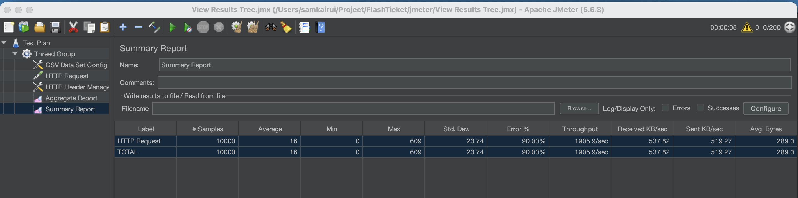
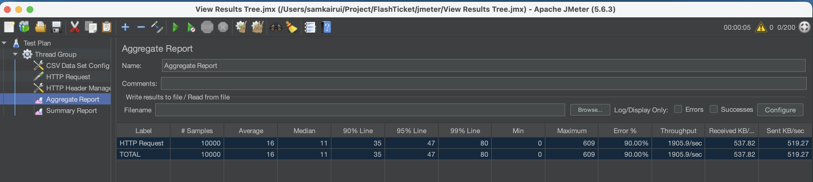

# FlashTicket

FlashTicket is a work-in-progress microservices backend for high-concurrency ticket sales. It combines JWT-based access control, Redis Lua scripts for atomic stock reservation, Kafka events for asynchronous inventory persistence, MySQL, and an API Gateway.

FlashTicket 是一个面向高并发抢票场景的微服务后端项目。系统使用 JWT 进行权限控制，通过 Redis Lua 脚本原子预留库存，并使用 Kafka 将库存事件异步同步至 MySQL，统一由 API Gateway 对外提供接口。

## Features / 已实现功能

- Registration and login with BCrypt password hashing
- RSA-signed JWT tokens with `USER` and `ADMIN` roles
- Gateway routing, authorization, and Redis-backed rate limiting
- Ticket creation, lookup, update, cancellation, and Redis caching
- Inventory creation, lookup, and manual stock adjustment
- Atomic reservation and release through Redis Lua scripts
- Per-user reservation keys with a five-minute TTL
- Kafka-based `inventory.reserved` and `inventory.release` processing
- Idempotent MySQL synchronization through processed-event records
- Flyway database migrations for Auth, Ticket, and Inventory services
- Docker Compose infrastructure for MySQL, Redis, Kafka, and ZooKeeper

已实现用户注册登录、JWT 权限控制、票种管理、库存管理、Redis 原子预留与释放、Kafka 库存事件、MySQL 幂等同步、网关路由及限流。

> `order-service` is under development. Order creation has partial implementation, while query, cancellation, payment completion, database configuration, and Gateway routing are not complete.
>
> `order-service` 正在开发中。目前仅部分实现订单创建；订单查询、取消、支付完成、数据库配置及 Gateway 路由尚未完成。

## Architecture / 架构

```text
Client
  |
  v
API Gateway :8080
  |-- Auth Service :8081 ------> MySQL
  |-- Ticket Service :8082 ----> MySQL + Redis
  `-- Inventory Service :8083 -> Redis Lua -> Kafka -> MySQL
```

Reservation flow / 库存预留流程：

1. Inventory Service validates the ticket and sale window through Ticket Service.
2. A Redis Lua script checks the user's reservation and decrements stock atomically.
3. The service submits an `inventory.reserved` event to Kafka.
4. The Inventory consumer updates MySQL idempotently.

Inventory Service 会先验证票种及销售时间，再通过 Redis Lua 原子扣减库存，随后提交 Kafka 事件，由消费者幂等更新 MySQL。

## Tech stack / 技术栈

| Area | Technology |
| --- | --- |
| Language | Java 21 |
| Framework | Spring Boot 4.1.1 |
| Gateway | Spring Cloud Gateway |
| Security | Spring Security, OAuth2 Resource Server, JWT |
| Persistence | MySQL 8, MyBatis, Flyway |
| Cache and concurrency | Redis, Lua |
| Messaging | Kafka, ZooKeeper |
| Load testing | Apache JMeter 5.6.3 |
| Build and infrastructure | Maven Wrapper, Docker Compose |

## Repository structure / 项目结构

```text
FlashTicket/
├── api-gateway/        # Routing, JWT authorization, and rate limiting
├── auth-service/       # Registration, login, and JWT generation
├── ticket-service/     # Ticket management and Redis caching
├── inventory-service/  # Atomic inventory reservation and Kafka synchronization
├── order-service/      # Incomplete order workflow under development
├── docker/mysql/init/  # Local service-database initialization
├── jmeter/             # JMeter data and result screenshots
├── keys/               # Local RSA keys
├── docker-compose.yml
└── DEVELOPMENT.md
```

## Local ports / 本地端口

| Component | Port |
| --- | ---: |
| API Gateway | `8080` |
| Auth Service | `8081` |
| Ticket Service | `8082` |
| Inventory Service | `8083` |
| MySQL | `3307` |
| Redis | `6379` |
| Kafka | `9092` |

## Local setup / 本地运行

Requirements: Java 21, Docker, Docker Compose, and OpenSSL when RSA keys need to be generated.

环境要求：Java 21、Docker、Docker Compose；需要重新生成 RSA 密钥时还需安装 OpenSSL。

### 1. Start infrastructure / 启动基础设施

```bash
docker compose up -d
docker compose ps
```

On a new MySQL volume, the initialization script creates `flashticket_auths`, `flashticket_ticket`, and `flashticket_inventory`. For an existing volume, create any missing databases manually:

新的 MySQL Volume 会自动创建三个服务数据库。旧 Volume 若缺少数据库，可手动执行：

```bash
docker exec flashticket-mysql mysql -uroot -proot -e \
  "CREATE DATABASE IF NOT EXISTS flashticket_auths;
   CREATE DATABASE IF NOT EXISTS flashticket_ticket;
   CREATE DATABASE IF NOT EXISTS flashticket_inventory;"
```

### 2. Prepare local RSA keys / 准备本地 RSA 密钥

```bash
mkdir -p keys
openssl genpkey -algorithm RSA -out keys/private.pem -pkeyopt rsa_keygen_bits:2048
openssl rsa -pubout -in keys/private.pem -out keys/public.pem
```

Never commit `keys/private.pem` or reuse local credentials in production.

不要提交 `keys/private.pem`，也不要在生产环境使用本地示例密钥或密码。

### 3. Start the services / 启动服务

Run each command in a separate terminal from the repository root:

```bash
cd auth-service
./mvnw spring-boot:run
```

```bash
cd ticket-service
./mvnw spring-boot:run
```

```bash
cd inventory-service
./mvnw spring-boot:run
```

```bash
cd api-gateway
./mvnw spring-boot:run
```

Ticket and Inventory expose direct health checks. Auth and Gateway currently protect non-API paths through their security configuration.

Ticket 与 Inventory 提供直接健康检查；Auth 与 Gateway 当前会通过安全配置保护非 API 路径。

```bash
curl http://localhost:8082/actuator/health
curl http://localhost:8083/actuator/health
```

## API overview / API 概览

Auth endpoints are public. Other supported routes should normally be accessed through `http://localhost:8080` with a JWT.

认证接口允许公开访问。其他已接入接口通常应通过 `http://localhost:8080` 并携带 JWT 调用。

| Service | Method and path | Gateway access |
| --- | --- | --- |
| Auth | `POST /api/v1/auth/register` | Public |
| Auth | `POST /api/v1/auth/login` | Public |
| Ticket | `GET /api/v1/tickets/{id}` | `USER`, `ADMIN` |
| Ticket | `GET /api/v1/tickets/event/{eventId}` | `USER`, `ADMIN` |
| Ticket | `POST /api/v1/tickets` | `ADMIN` |
| Ticket | `PUT /api/v1/tickets/{id}` | `ADMIN` |
| Ticket | `PATCH /api/v1/tickets/{id}/status/cancel` | `ADMIN` |
| Inventory | `GET /api/v1/inventory/{ticketId}` | `USER`, `ADMIN` |
| Inventory | Inventory write endpoints | `ADMIN` |

### Authentication / 身份认证

```bash
curl -X POST http://localhost:8080/api/v1/auth/register \
  -H 'Content-Type: application/json' \
  -d '{"email":"user@example.com","password":"change-me"}'
```

```bash
curl -X POST http://localhost:8080/api/v1/auth/login \
  -H 'Content-Type: application/json' \
  -d '{"email":"user@example.com","password":"change-me"}'
```

New accounts receive the `USER` role. After changing a local account to `ADMIN`, log in again to obtain a token containing the updated role.

新账号默认为 `USER`。在本地数据库修改为 `ADMIN` 后，需要重新登录取得包含新角色的 Token。

### Create a ticket and inventory / 创建票种与库存

```bash
curl -X POST http://localhost:8080/api/v1/tickets \
  -H 'Authorization: Bearer <ADMIN_JWT>' \
  -H 'Content-Type: application/json' \
  -d '{
    "eventId":"event-001",
    "name":"Early Bird",
    "description":"Limited allocation",
    "price":49.90,
    "totalStock":1000,
    "saleStartTime":"2027-01-01T10:00:00",
    "saleEndTime":"2027-01-31T23:59:59"
  }'
```

Use the returned Ticket ID to initialize inventory:

```bash
curl -X POST http://localhost:8080/api/v1/inventory/insert \
  -H 'Authorization: Bearer <ADMIN_JWT>' \
  -H 'Content-Type: application/json' \
  -d '{"ticketId":"<TICKET_ID>","totalStock":1000}'
```

### Reserve and release / 预留与释放

```bash
curl -X POST http://localhost:8080/api/v1/inventory/reserve \
  -H 'Authorization: Bearer <ADMIN_JWT>' \
  -H 'Content-Type: application/json' \
  -d '{"ticketId":"<TICKET_ID>","userId":"<USER_ID>","reservedStock":1}'
```

```bash
curl -X POST http://localhost:8080/api/v1/inventory/release \
  -H 'Authorization: Bearer <ADMIN_JWT>' \
  -H 'Content-Type: application/json' \
  -d '{"ticketId":"<TICKET_ID>","userId":"<USER_ID>","reservedStock":1}'
```

## Redis and Kafka / Redis 与 Kafka

| Key or topic | Purpose |
| --- | --- |
| `ticket:{ticketId}` | Ticket cache, 10-minute TTL |
| `tickets:event:{eventId}` | Ticket list cache |
| `ticket:not-found:{ticketId}` | Ticket negative cache |
| `inventory:{ticketId}` | Inventory detail cache |
| `inventory:not-found:{ticketId}` | Inventory negative cache, 30-second TTL |
| `inventory:stock:{ticketId}` | Atomic available-stock counter |
| `inventory:reserved:{ticketId}:{userId}` | Per-user reservation, five-minute TTL |
| `inventory.reserved` | Successful reservation event |
| `inventory.release` | Reservation release event |

Redis is the concurrency boundary for reservation and release. Kafka consumers synchronize successful changes to MySQL and use `processed_events` for event idempotency.

Redis 是库存并发控制边界；Kafka Consumer 将成功变更同步至 MySQL，并通过 `processed_events` 保证事件幂等。

## Load-test result / 压测结果

The latest recorded benchmark used Apache JMeter 5.6.3 with `10,000` unique users competing for `1,000` tickets. The JMeter Thread Group was configured with `200` threads, a `5`-second ramp-up period, and `50` loops (`200 / 5 / 50`), producing `10,000` total requests. Test users are stored in [`jmeter/users-10000.csv`](./jmeter/users-10000.csv).

最新记录使用 Apache JMeter 5.6.3，让 `10,000` 个不同用户抢 `1,000` 张票。JMeter Thread Group 配置为 `200` 个线程、`5` 秒 Ramp-up、循环 `50` 次（`200 / 5 / 50`），共发出 `10,000` 个请求。测试用户位于 [`jmeter/users-10000.csv`](./jmeter/users-10000.csv)。

| Metric / 指标 | Result / 结果 |
| --- | ---: |
| Total requests / 总请求数 | `10,000` |
| Average response / 平均响应 | `16 ms` |
| Minimum / 最小响应 | `0 ms` |
| Maximum / 最大响应 | `609 ms` |
| Standard deviation / 标准差 | `23.739711832918275 ms` |
| JMeter error rate | `90.00%` (`0.9`) |
| Throughput / 吞吐量 | `1,905.8509624547362 requests/second` |
| Received / 接收速率 | `537.8236968744044 KB/second` |
| Sent / 发送速率 | `519.2699399656947 KB/second` |
| Average response size / 平均响应大小 | `288.9688 bytes` |

The `90%` JMeter error rate is consistent with approximately `1,000` successful reservations followed by approximately `9,000` stock-exhaustion rejections. The reported throughput includes both successful and failed responses. JMeter treats expected non-2xx responses as errors, while the summary alone does not identify the response code of every failure.

`90%` 的 JMeter 错误率与约 `1,000` 个成功预留、约 `9,000` 个库存耗尽拒绝相符。报告中的吞吐量同时包含成功与失败响应；JMeter 会把预期的非 2xx 响应统计为错误，仅凭汇总报告无法确认每个失败请求的响应码。





Separate real-HTTP correctness checks verified exact `100/900` and `1000/9000` success/conflict splits, Redis stock `0`, and matching MySQL totals without negative stock or overselling. The repeatable commands and cleanup procedure are kept in [INVENTORY_LOAD_TEST.md](./INVENTORY_LOAD_TEST.md).

独立的真实 HTTP 正确性测试验证了严格的 `100/900` 与 `1000/9000` 成功/冲突结果，Redis 最终库存为 `0`，MySQL 数量一致，未出现负库存或超卖。可重复执行的命令及清理步骤保存在 [INVENTORY_LOAD_TEST.md](./INVENTORY_LOAD_TEST.md)。

> The JMeter test calls Inventory Service directly on port `8083`; it measures the inventory path without Gateway authentication or rate limiting.
>
> JMeter 测试直接访问 `8083`，因此结果不包含 Gateway 鉴权与限流开销。

## Current limitations / 当前限制

- Reservation keys expire after five minutes, but expiration does not automatically return stock yet.
- Ticket status does not automatically change to `SOLD_OUT` when inventory reaches zero.
- Kafka reservation publishing is asynchronous; the HTTP response may return before broker acknowledgement, while the failure callback attempts Redis compensation.
- Order Service remains incomplete and is not routed by API Gateway.
- Payment, electronic-ticket delivery, notifications, distributed tracing, and production secret management are not implemented.

- 五分钟预留 Key 过期后，库存暂时不会自动归还。
- 库存归零后，Ticket 状态暂时不会自动变为 `SOLD_OUT`。
- Kafka 预留事件采用异步提交；HTTP 可能先于 Broker 确认返回，失败回调会尝试补偿 Redis。
- Order Service 尚未完成，也未接入 API Gateway。
- 支付、电子票交付、通知、分布式链路追踪及生产级密钥管理尚未实现。

## Security / 安全说明

The current configuration is for local development only. Do not expose infrastructure ports publicly, use the sample database password in production, or commit private RSA keys.

当前配置仅用于本地开发。请勿公开暴露基础设施端口、在生产环境使用示例数据库密码，或提交 RSA 私钥。

For the proposed architecture and roadmap, see [DEVELOPMENT.md](./DEVELOPMENT.md).
