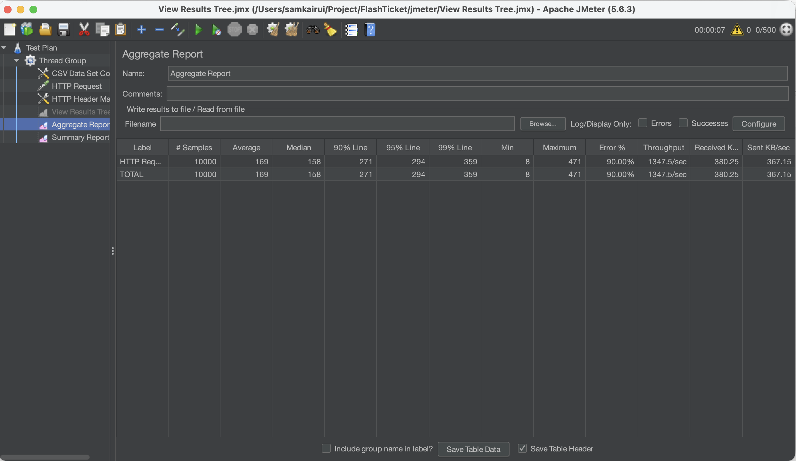
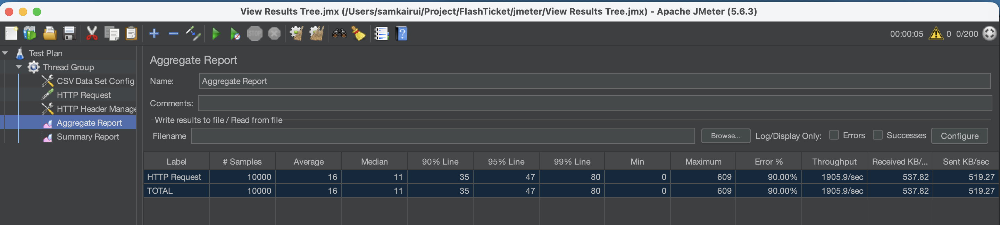

# FlashTicket

FlashTicket 是一个面向高并发抢票场景的微服务后端项目。系统通过 Redis Lua 原子预留库存，使用 Kafka 异步同步 MySQL、创建订单并触发支付记录，同时通过可重试任务处理取消和超时后的库存释放。

> 当前项目适合本地开发与架构演示，尚未完成真实支付渠道、生产级运维和全部跨服务一致性能力。
FlashTicket is a work-in-progress microservices backend for high-concurrency ticket sales. It combines JWT-based access control, Redis Lua scripts for atomic stock reservation, Kafka events for asynchronous inventory and order processing, MySQL, and an API Gateway.

FlashTicket 是一个面向高并发抢票场景的微服务后端项目。系统使用 JWT 进行权限控制，通过 Redis Lua 脚本原子预留库存，并使用 Kafka 异步同步库存及创建订单。目前 Auth、Ticket 与 Inventory 已接入 API Gateway，Order 仍通过 `8084` 直接访问。

## 核心能力

- BCrypt 密码加密、RSA JWT 认证与 `USER` / `ADMIN` 权限控制
- API Gateway 路由、鉴权与基于 Redis 的限流
- Ticket 管理及 Redis 缓存
- Redis Lua 原子库存预留与释放
- Kafka 驱动的库存同步、订单创建和支付记录创建
- MySQL 消费幂等与相同 `releaseId` 的重复释放保护
- 五分钟未付款订单过期
- 持久化库存释放任务、失败重试与最终恢复
- Order Outbox 可靠发布 `order.created`

## 架构

```text
Client
  |
  v
API Gateway :8080
  |-- Auth Service :8081 ------> MySQL
  |-- Ticket Service :8082 ----> MySQL + Redis
  `-- Inventory Service :8083
          |-- Redis Lua: reserve / release
          `-- inventory.reserved --> Kafka
                    |-- Inventory Consumer --> MySQL inventory
                    `-- Order Consumer ------> Order Service :8084
                                                  |-- orders
                                                  `-- order_outbox_events (PENDING)
                                                          |
                                                   Outbox Worker
                                                          |
                                                   order.created --> Kafka
                                                          |
                                                   Payment Consumer
                                                          |
                                                   Payment Service :8085
                                                          |-- MySQL payments
                                                          `-- Redis payment cache

Order cancel / five-minute expiry
  --> inventory_release_tasks
  --> Inventory release API
  --> Redis + MySQL stock recovery
```

## 服务

| 服务 | 端口 | 当前职责 |
| --- | ---: | --- |
| API Gateway | 8080 | Auth、Ticket、Inventory、Order、Payment 路由，JWT 鉴权与限流 |
| Auth Service | 8081 | 注册、登录、JWT 签发 |
| Ticket Service | 8082 | 票种 CRUD、销售状态与缓存 |
| Inventory Service | 8083 | 库存管理、预留、释放及 Kafka 同步 |
| Order Service | 8084 | 创建、查询、取消、标记支付、过期及 Outbox 发布 |
| Payment Service | 8085 | 消费 `order.created`，创建和查询 `PENDING` 支付记录 |

Gateway 已配置五个业务服务的 `/api/v1/**` 路由；各服务端口仍可用于本地诊断。

## 核心流程

### 预留、订单与支付记录

1. Inventory Service 向 Ticket Service 校验票种和销售时间。
2. Redis Lua 原子检查重复预留并扣减 `availableStock`。
3. 发布 `inventory.reserved`。
4. Inventory Consumer 幂等增加 MySQL `reserved_stock`。
5. Order Consumer 创建五分钟有效的 `PENDING_PAYMENT` Order，并在同一事务写入 `PENDING` Outbox。
6. Outbox Worker 发布 `order.created`，成功后将 Outbox 标记为 `PUBLISHED`。
7. PaymentConsumer 消费事件，创建一条 `PENDING` payment，并写入 Redis 缓存。

### 取消或超时释放

1. 用户取消，或调度器依据 `orders.expires_at` 将五分钟未支付订单标记为 `EXPIRED`。
2. Order Service 创建持久化的 `inventory_release_tasks`。
3. Worker 使用固定 `releaseId` 请求 Inventory Service 释放库存。
4. Inventory Service 通过 Lua 和事件幂等保护，确保重复请求不会重复增加库存。
5. 暂时失败的任务进入 `RETRY`；服务恢复后重试至 `SUCCESS`。

Redis reservation key 的 15 分钟 TTL 只是安全缓冲，订单的五分钟 `expires_at` 才是业务过期依据。

## 技术栈

| 范围 | 技术 |
| --- | --- |
| Runtime | Java 21, Spring Boot 4.1.1 |
| Security | Spring Security, OAuth2 Resource Server, RSA JWT |
| Data | MySQL 8, MyBatis, Flyway |
| Cache / concurrency | Redis, Lua |
| Messaging | Kafka, ZooKeeper |
| Build / infrastructure | Maven Wrapper, Docker Compose |
| Load test | Apache JMeter 5.6.3 |

## 本地运行

前置条件：Java 21、Docker、Docker Compose。

```bash
docker compose up -d
```

首次运行 Auth Service 前生成 RSA 密钥：

```bash
mkdir -p keys
openssl genpkey -algorithm RSA \
  -out keys/private.pem \
  -pkeyopt rsa_keygen_bits:2048
openssl rsa \
  -pubout \
  -in keys/private.pem \
  -out keys/public.pem
```

分别在独立终端启动服务：

```bash
cd auth-service && JWT_PRIVATE_KEY=file:../keys/private.pem JWT_PUBLIC_KEY=file:../keys/public.pem ./mvnw spring-boot:run
cd ticket-service && ./mvnw spring-boot:run
cd inventory-service && ./mvnw spring-boot:run
cd order-service && ./mvnw spring-boot:run
cd payment-service && ./mvnw spring-boot:run
cd api-gateway && ./mvnw spring-boot:run
```

检查主要业务服务：

```bash
curl http://localhost:8082/actuator/health
curl http://localhost:8083/actuator/health
curl http://localhost:8084/actuator/health
curl http://localhost:8085/actuator/health
```

## 主要 API

| 方法 | 地址 | 用途 |
| --- | --- | --- |
| POST | `http://localhost:8080/api/v1/auth/register` | 注册 |
| POST | `http://localhost:8080/api/v1/auth/login` | 登录 |
| GET / POST | `http://localhost:8080/api/v1/tickets` | 查询 / 创建票种 |
| POST | `http://localhost:8080/api/v1/inventory/{ticketId}/reserve` | 预留库存 |
| POST | `http://localhost:8080/api/v1/inventory/release` | 幂等释放库存 |
| GET | `http://localhost:8080/api/v1/orders/{orderId}` | 查询订单 |
| POST | `http://localhost:8080/api/v1/orders/{orderId}/cancel` | 取消订单 |
| POST | `http://localhost:8080/api/v1/orders/{orderId}/paid` | 标记订单已支付 |
| POST | `http://localhost:8080/api/v1/payments` | 手动创建支付记录 |
| GET | `http://localhost:8080/api/v1/payments/{paymentId}` | 查询支付记录 |

正常业务流中 payment 由 `order.created` 自动触发，无需手动调用创建接口。

## 实机验证

以下结果来自真实启动的 MySQL、Redis、Kafka 和微服务，不是单元测试或模拟结果。

### 库存释放链路（2026-09-27）

| 场景 | 验证结果 |
| --- | --- |
| 正常预留 | Redis `availableStock` 减少，reservation key 存在，MySQL `reserved_stock` 增加，Order 为 `PENDING_PAYMENT` |
| 用户取消 | Order 为 `CANCELLED`，release task 为 `SUCCESS`，Redis / MySQL 库存恢复 |
| 五分钟未付款 | Order 在 `expires_at` 后变成 `EXPIRED`，release task 为 `SUCCESS`，库存恢复 |
| 重复释放 | 相同 `releaseId` 请求两次均安全返回，Redis 只增加一次，MySQL 只释放一次 |
| Inventory 暂时不可用 | release task 先进入 `RETRY`，Inventory 恢复后变成 `SUCCESS`，库存最终恢复为 `available=10, reserved=0` |

### Order Outbox 与 Payment（2026-09-29）

| 检查点 | 实际结果 |
| --- | --- |
| 库存预留 | HTTP 200；库存由 `10/0` 变为 `8/2` |
| Order | 创建为 `PENDING_PAYMENT`，金额 `70.00` |
| Outbox | `PENDING -> PROCESSING -> PUBLISHED`，`retry_count=0` |
| Kafka | `order.created` 包含相同 order、user、amount 和 expiresAt；consumer lag 为 0 |
| Payment | `payments` 表生成一条 `PENDING` 记录，金额 `70.00` |
| Redis | `payment:{paymentId}` 与 `payment:order:{orderId}` 均出现，TTL 为 300 秒 |

五分钟后 Redis payment 缓存按 TTL 到期，Order 正常变成 `EXPIRED`。当前 Payment 记录仍保持 `PENDING`，这是尚待补齐的跨服务状态同步。

## 并发压测

JMeter 直接请求 Inventory Service 的库存预留接口：200 threads、5 秒 ramp-up、每线程 50 次，共 10,000 次请求；初始库存为 1,000。

| 指标 | 结果 |
| --- | ---: |
| Average | 16 ms |
| Maximum | 609 ms |
| Throughput | 1905.8509624547362 requests/s |
| 成功预留 | 1,000 |
| 预期库存冲突 | 9,000 |

JMeter 显示的 90% error rate 来自库存售罄后的预期冲突，不代表服务异常。该结果只覆盖 Inventory 直接调用，不代表 Gateway 或完整端到端链路性能。





## 当前限制

- Payment 目前完成记录创建和查询，真实支付渠道、回调及状态更新仍未完成。
- Order 过期后 Payment 仍可能保持 `PENDING`。
- `order.created` 已使用 Outbox；其他跨服务状态变更尚未全部采用同等级的可靠发布机制。
- 缺少 DEAD release task 的管理、告警和人工补偿入口。
- Ticket 售罄状态同步、通知和电子票流程尚未完成。

更多实现细节、验证命令与开发说明见 [DEVELOPMENT.md](./DEVELOPMENT.md)。
